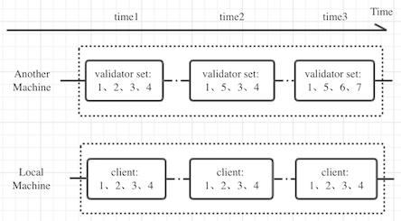

This repository (WIP) is a proof of concept of sentry protocol, and utilizes cosmos-sdk to accomplish implementation.

Sentry protocol is  probably the first protocol to ensure security when crossing messages between blockchains powered by dpos consensus without needs to trust third parties, which is a failure to ICS (Interchain Standards).

## Weakness of ICS

[ICS](https://github.com/cosmos/ics) is a cross-chain protocol proposed by [Cosmos](https://github.com/cosmos) team.

Even through ICS claimed the sercurity attibute hold by its protocol, but that's not conscientious. Take crossing messages between dpos blockchains, which is the default consensus algorithm armed by cosmos, for instance, attackers can forge messages forwarded to another blockchain and make it effective in ICS protocol circumstances.

ICS uses client semantics in local machine to verify the consensus transcript & state sub-components of another machine, as for dpos machine, that's mainly validator set at present of another machine. Whereas the rules in ICS protocol can't guaranty the validator set recorded in local machine client is the latest of that in another machine, instead of laid-off validator set, which can cause security problems.

 

Figure-1: illustration
  
In figure-1, at time 3, validators 2、3、4 are laid-off in another machine and can be free to sign arbitrary messages to local machine. And local machine would take that into effect because the validator set in client admitting validators 2、3、4，which is a critial situation in ICS.

## Song of sentry

Fortunately, sentry protocol designed a mechanism to work that out elegantly. Please move to [specs](x/sentry/spec/protocol.md) to dig out.
